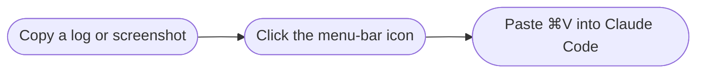
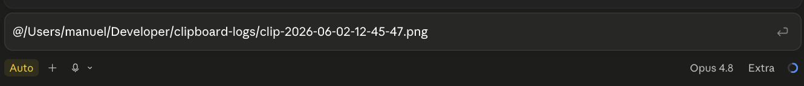

# ClipRef

**Turn your clipboard into a file you can hand to [Claude Code](https://claude.com/claude-code).**

Copy a log or a screenshot, click the menu-bar icon, and ClipRef saves it to a file and
puts an `@`-reference on your clipboard. Paste that into Claude Code and it reads the
file only when it actually needs to — so giant logs and images stay out of your context
until they matter.



<sub>That last step drops in something like `@/Users/you/Developer/clipboard-logs/clip-2026-06-02-12-45-47.png` — a reference Claude resolves only when it needs the contents.</sub>

## Install

> **Not published yet.** When it's released, installing will be one line:
>
> ```sh
> brew install --cask clipref
> ```
>
> *(or download `ClipRef.app` from the Releases page and drag it to Applications.)*

Until then, build it yourself — macOS 14+ and Xcode 16+:

<details>
<summary>Build from source</summary>

```sh
git clone https://github.com/Manuel-Welsch/ClipRef.git
cd ClipRef
xcodebuild -project ClipRef.xcodeproj -scheme ClipRef \
  -configuration Release -derivedDataPath build -allowProvisioningUpdates build
ditto build/Build/Products/Release/ClipRef.app /Applications/ClipRef.app
open /Applications/ClipRef.app
```

If signing fails, open `ClipRef.xcodeproj` in Xcode and pick your own team under
*Signing & Capabilities*.

</details>

## Using ClipRef

ClipRef sits in your **menu bar** (a clipboard icon) — no Dock icon, no window.

1. Copy anything — a log, an error message, a screenshot.
2. **Left-click** the icon. ClipRef saves it (text → `.txt`, image → `.png`) and flashes
   a checkmark. Your clipboard now holds an `@`-path to that file.
3. Switch to Claude Code and press **⌘V**. The pasted `@…` becomes a file reference.



### Example

Your app crashes. You select the whole stack trace and ⌘C, then click the ClipRef icon —
a checkmark flashes and your clipboard is now:

```
@/Users/you/Developer/clipboard-logs/clip-2026-06-02-14-03-12.txt
```

Over in Claude Code you type **`why is this crashing?`**, press **⌘V**, and hit return.
Claude pulls the full trace from the file — without 300 lines flooding the conversation.

### Menu (right-click)

<!-- TODO: replace this table with a screenshot of the right-click menu -->

| Item | What it does |
| --- | --- |
| **Save Clipboard Now** | Same as a left-click |
| **Open Folder** | Opens where your files are saved |
| **Change Folder…** | Pick a different save location |
| **Launch at Login** | On by default; toggle here |
| **Quit ClipRef** | Quit the app |

## Good to know

- **Where files go:** `~/Developer/clipboard-logs` by default — change it from the menu.
- **Self-cleaning:** files older than 7 days are deleted automatically, so the folder
  never piles up. (`defaults write de.manuelwelsch.ClipRef retentionDays 14` keeps them
  longer.)
- **Double-clicking is safe:** if your clipboard already holds an `@`-reference, ClipRef
  leaves it alone instead of saving the reference into a new file.

## License

[MIT](LICENSE) © 2026 Manuel Welsch
